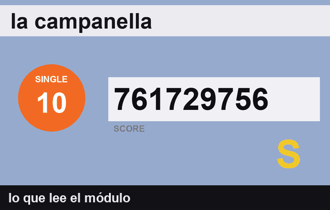
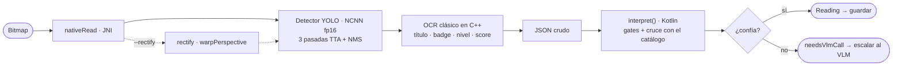
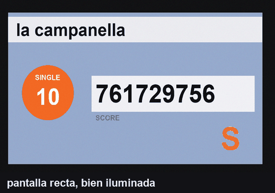
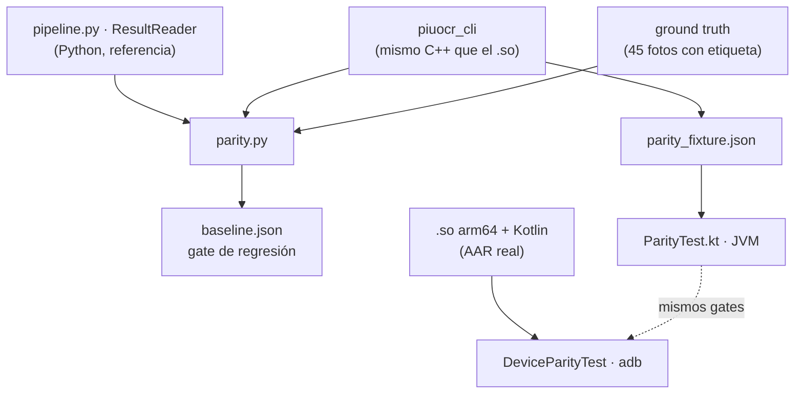

# piu-ocr · Android

[](#requisitos)
[](#requisitos)
[](docs/ARQUITECTURA.md#3-el-aar-por-dentro)
[](docs/ARQUITECTURA.md#3-el-aar-por-dentro)
[](#qué-es)
[](#estructura)
[](#estructura)

Lectura de pantallas de resultado de **Pump It Up** en el teléfono, **sin LLM**:
detector YOLO en NCNN + OCR clásico en C++ + matching difuso contra el catálogo
de 675 canciones en Kotlin. Se consume como un AAR de ~22 MB con las cuatro ABIs
y sin dependencias transitivas. Los campos en los que no se confía se marcan
para que la app los escale a un VLM.

<p align="center">
  
</p>

<p align="center"><sub>Qué lee el módulo y dónde — animación generada con <code>tools/parity/animate.py</code></sub></p>

## Contenido

- [¿Qué es?](#qué-es)
- [Quickstart](#quickstart)
- [Resultados](#resultados)
- [Cómo funciona](#cómo-funciona)
- [Verificar un cambio](#verificar-un-cambio)
- [Compilar](#compilar)
- [Estructura](#estructura)
- [Documentación](#documentación)
- [Requisitos](#requisitos)

## ¿Qué es?

Un módulo Android que recibe un `Bitmap` de la pantalla de resultados y devuelve
la **canción**, el **chart type**, el **nivel** y el **score**, con una señal de
confianza por campo. Nada de inferencia de lenguaje en el dispositivo: el título
se lee glifo por glifo y se resuelve por parecido contra el catálogo cerrado
("no hace falta leer bien, hace falta leer parecido").

El resultado es un dato en el que se puede confiar o una marca para escalar:

```kotlin
data class Field<T>(val value: T?, val confidence: Float, val reason: String? = null)
```

`reason != null` significa **"no confío, escalalo"**. Un campo con `reason` no se
debe escribir en la base. La política es un nombre si el gate pasa, si no se
escala — nunca dos candidatos, porque está medido que debajo del gate el segundo
casi nunca acierta.

## Quickstart

```kotlin
val ocr = PiuOcr.create(context)
val r = ocr.read(bitmap)

r.song.value           // String?  canción resuelta contra el catálogo
r.score.value          // Int?     puntaje
r.score.confidence     // Float    0..1
r.score.reason         // null si se confía; si no, por qué no

if (r.needsVlmCall) escalarAlVlm(r)   // alguno de los campos no pasó el gate
ocr.close()
```

```kotlin
// build.gradle.kts
implementation(project(":piu-ocr"))        // como módulo…
// implementation(files("libs/piu-ocr-release.aar"))   // …o como AAR
```

Más detalle en **[docs/API.md](docs/API.md)**.

## Resultados

45 fotos de cabina con ground truth, de 58 en total. End-to-end, con el detector
NCNN corriendo **en el teléfono**:

| campo | acierto | precisión cuando responde | cobertura |
|---|---:|---:|---:|
| **score** | **0.905** | 0.974 | 0.929 |
| chart type | 0.767 | 0.786 | 0.977 |
| canción | 0.733 | 0.892 | 0.822 |
| nivel | 0.714 | 0.789 | 0.905 |

<p align="center">
  
</p>

El **gate** convierte errores en escalaciones: por debajo de un margen mínimo la
respuesta se rechaza y se manda al VLM. De las 37 fotos de canción que pasan el
gate, 33 son correctas.

<p align="center">
  
</p>

Informe completo con todas las gráficas: **[docs/INFORME.md](docs/INFORME.md)**.

## Cómo funciona



El único modelo es el detector; el OCR es umbralizar, componentes conexas,
morfología y producto punto contra plantillas int8. El matching final vive en
Kotlin para poder ajustar gates sin recompilar el `.so`.

El módulo tiene que aguantar condiciones difíciles — así se ve el barrido de
ángulo, brillo y glare sobre pantallas sintéticas:

<p align="center">
  
</p>

> Las constantes del OCR y los gates salieron de mediciones y varias son
> contraintuitivas: cambiarlas degrada el sistema **en silencio**. Están todas
> documentadas en **[docs/ARQUITECTURA.md#7](docs/ARQUITECTURA.md#7-constantes-calibradas)**.

## Verificar un cambio

Tres capas, más una validación sintética que corre sin el dataset:



```bash
tools/host/fetch.sh                                  # una vez: ncnn + opencv-mobile Linux
python3 tools/parity/parity.py --detect --baseline   # C++ del .so vs Python vs GT
./gradlew testReleaseUnitTest                        # Kotlin == réplica Python
tools/parity/device.sh                               # lo mismo en un teléfono por adb
```

| capa | qué prueba | comando |
|---|---|---|
| host | C++ del `.so` == Python == GT | `parity.py --detect --baseline` |
| JVM | `interpret()` == réplica Python, sin fotos | `./gradlew testReleaseUnitTest` |
| device | `.so` arm64 + Kotlin reales | `tools/parity/device.sh` |
| synth | el código nuevo bajo ángulo/luz conocidos | `parity.py --synth --rectify` |

El TTA del detector es lo que más mueve la aguja; así se eligieron las tres
pasadas (mismo costo que la config anterior, **+9 pts** de acierto):

<p align="center">
  
</p>

<p align="center">
  
</p>

Cómo funciona cada capa y qué mide exactamente:
**[docs/VERIFICACION.md](docs/VERIFICACION.md)**.

## Compilar

```bash
export JAVA_HOME=~/.jdks/ms-17.0.20.1     # JDK 17 o 21; el 27-ea NO
export ANDROID_HOME=~/Android/Sdk
./gradlew assembleRelease                 # build/outputs/aar/piu-ocr-release.aar
```

Trampas conocidas del build y por qué las cuatro ABIs:
[docs/ARQUITECTURA.md#10](docs/ARQUITECTURA.md#10-compilación).

## Estructura

```
src/main/cpp/        detector (NCNN + TTA a mano), segment, text, badge, score,
                     recognize, rectify, pipeline, jni_bridge
src/main/kotlin/     PiuOcr (gates, cruce con catálogo), SongMatcher (difflib porteado)
src/main/assets/     piu_yolo fp16, chars/level/digits .bin (int8), catalog.json
src/test/            ParityTest.kt, GateSweepTest.kt          (JVM)
src/androidTest/     DeviceParityTest.kt                      (device)
tools/host/          el mismo C++ como binario Linux + fetch.sh
tools/parity/        comparador, baseline, buckets, gráficas y animaciones
tools/synth.py       pantallas PIU sintéticas para validar sin el dataset
docs/                documentación (ver abajo)
```

## Documentación

| documento | para qué |
|---|---|
| **[docs/README.md](docs/README.md)** | índice de la documentación |
| [docs/API.md](docs/API.md) | usar el AAR desde Kotlin: `PiuOcr`, `Reading`, `Field`, integración |
| [docs/ARQUITECTURA.md](docs/ARQUITECTURA.md) | diseño interno, constantes calibradas y gates |
| [docs/VERIFICACION.md](docs/VERIFICACION.md) | las tres capas de test y el baseline |
| [docs/INFORME.md](docs/INFORME.md) | números medidos y qué falta |
| [docs/PLAN_LUZ_ANGULO.md](docs/PLAN_LUZ_ANGULO.md) | plan opt-in para luz irregular y ángulos |

## Requisitos

- JDK 17 o 21, Android SDK, NDK `29.0.14206865`.
- `minSdk 24`.
- Para los tests de paridad: el dataset y el venv de Python (ver
  [docs/VERIFICACION.md](docs/VERIFICACION.md#layout-esperado)).
